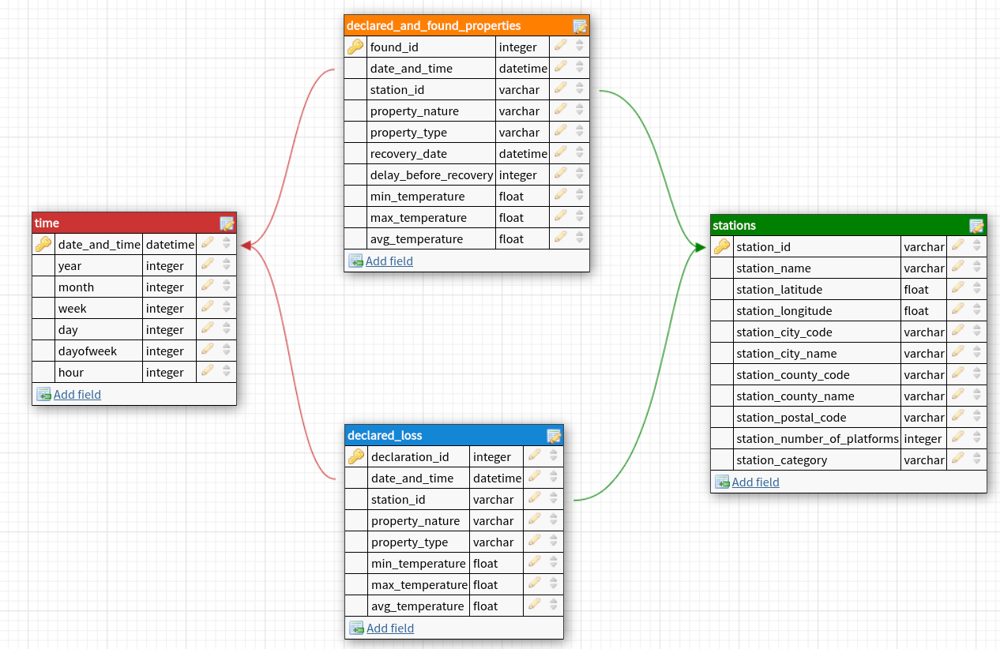

```python
from IPython.display import display, HTML

display(HTML(data="""
<style>
    div#notebook-container    { width: 95%; }
    div#menubar-container     { width: 95%; }
    div#maintoolbar-container { width: 99%; }
</style>
"""))
```


<style>
    div#notebook-container    { width: 95%; }
    div#menubar-container     { width: 95%; }
    div#maintoolbar-container { width: 99%; }
</style>


# LOPRO2TS : LOst PROperties Tracking Service in Train Stations

## Problem specification

A new startup is willing to create an app to allow users to track lost properties in different trains/stations in France, by providing them a AI-empowered step-by-step guidance based on property's characteristics, train station characteristics, etc. Therefore, their first object is to do a market research.<br>
To acquire a deep understanding of this mysterious unexplored phenomenon 👽 of lost properties in trains and/or stations, they decided to recruit the famous Data Engineer who helped the **Sparkify** startup to become N°1 in the world : Me 🧐!!! <br>
My mission this time is to create an ETL, _uh uhm_, **ELT** pipeline to create a more analytics-friendly version of the dataset they intend to use.

They decided to use some open datasets provided by the main French transportation service : [SNCF Group](https://www.sncf.com/en), and also temperature data provided by www.weathernews.fr.


## Datasets description

### List of French train stations  
This dataset is a json file with around 4K records. It lists french train stations and some of their characteristics. The dataset is updated on a yearly basis and can be downloaded [here](https://ressources.data.sncf.com/explore/dataset/referentiel-gares-voyageurs/download/?format=json&timezone=Europe/Berlin&lang=fr).<br>
Example of a record in the json file: 
```json
{'datasetid': 'referentiel-gares-voyageurs',
 'fields': {'adresse_cp': '93140',
            'alias_libelle_noncontraint': 'Remise à Jorelle',
            'code': '00002-1',
            'commune_code': '010',
            'commune_libellemin': 'Bondy',
            'departement_libellemin': 'Seine-Saint-Denis',
            'departement_numero': '93',
            'gare': '{"DRG_ON": true, "Etrangere_ON": false, "NbPltf": 1, '
                    '"Alias_Libelle_NonContraint": "Remise à Jorelle", '
                    '"Alias_Libelle_Fronton": "Remise à Jorelle", '
                    '"AgenceGC_Libelle": "Direction Générale des Gares '
                    'Île-de-France", "RegionSNCF_Libelle": "REGION DE '
                    'PARIS-EST", "UG_Libelle": null, "UT_Libelle": "BONDY GARE '
                    'REMISE A JORELLE TRAM TRAIN"}',
            'gare_agencegc_libelle': 'Direction Générale des Gares '
                                     'Île-de-France',
            'gare_alias_libelle_fronton': 'Remise à Jorelle',
            'gare_alias_libelle_noncontraint': 'Remise à Jorelle',
            'gare_drg_on': 'True',
            'gare_etrangere_on': 'False',
            'gare_nbpltf': 1,
            'gare_regionsncf_libelle': 'REGION DE PARIS-EST',
            'gare_ut_libelle': 'BONDY GARE REMISE A JORELLE TRAM TRAIN',
            'latitude_entreeprincipale_wgs84': '48.893170',
            'longitude_entreeprincipale_wgs84': '2.487751',
            'rg_libelle': 'Gare La Remise à Jorelle',
            'segmentdrg_libelle': 'b',
            'tvs': 'RJL',
            'tvss': '[{"TVS_Code": "RJL"}]',
            'uic_code': '0087988709',
            'wgs_84': [48.89317, 2.487751]},
 'geometry': {'coordinates': [2.487751, 48.89317], 'type': 'Point'},
 'record_timestamp': '2020-12-29T00:00:51.658+01:00',
 'recordid': 'fbaead07f41e47e2c3cc424e43e92972f898b740'}
```
The most interesting field for us is `fields` with the following sub-fields :
* **uic_code** : train station identification code
* **alias_libelle_noncontraint** : train station name
* **latitude_entreeprincipale_wgs84** and **longitude_entreeprincipale_wgs84** : latitude and longitude resp. of the station main entrance (based on  World Geodetic System 1984)
* **commune_code** and **commune_libellemin** : code and name of city where station is located
* **departement_numero** and **departement_libellemin** : code and name of the county where the station is located
* **adresse_cp** : postal code
* **gare_nbpltf** : number of platforms in station
* **segmentdrg_libelle** : station category encode as `a`, `b` or `c`, depend on the traffic coverage (nationnal/international, regional, local) and yearly number of passengers


### Lost properties declaration dataset 

This dataset is a csv with around 1.14M records. It contains information on loss declarations made by customers through various media (website, app, in person to SNCF staff, ...).  The dataset is updated on a daily basis and can be found [here](https://ressources.data.sncf.com/explore/dataset/objets-trouves-gares/download/?format=csv&timezone=Europe/Berlin&lang=fr&use_labels_for_header=true&csv_separator=%3B).<br>
This dataset is updated on a daily basis.<br>
Following are the list of the dataset's columns :
* **Date** : date of loss declaration by customer
* **Gare** : Name of the train station where the loss was declared
* **Code UIC** : train station identification code
* **Type d'objets** : category of the property (e.g. category can be `electronics` , `clothes`, ...)
* **Nature d'objets** : a more fine-grained category of the property (e.g. `mobile phone`, `scarf`, ...)

* **Type d'enregistrement** : recording type. Currently it has only one value : `Déclaration de Perte` (declaration of loss)


### Found properties dataset 

This dataset is a csv with around 700K records. It contains information on lost properties that have been declared by customers and found in trains/stations by staff. The data tells if the property was recovered by its owner. The dataset is updated on a daily basis and can be found [here](https://ressources.data.sncf.com/explore/dataset/objets-trouves-restitution/download/?format=csv&timezone=Europe/Berlin&lang=fr&use_labels_for_header=true&csv_separator=%3B).<br>
Following are the list of the dataset's columns :
* **Date** : it is unclear whether this is loss declaration date, or date when the property was found by the staff. Therefore we'll consider it as loss declaration date
* **Date et heure de restitution** : if property was recovered by its owner, this is the date of recovery
* **Gare** : Name of the train station where the property was found
* **Code UIC** : train station identification code
* **Type d'objets** : category of the property (e.g. category can be `electronics` , `clothes`, ...)
* **Nature d'objets** : a more fine-grained category of the property (e.g. `mobile phone`, `scarf`, ...)
* **Type d'enregistrement** : recording type. Currently it has only one value : `Objet trouvé` (Found object)


### Daily temperatures dataset 

70% of economic activities are sensitive to temperature data. Also cognitive abilities are shown to be impacted by temperature ([source](https://www.cambridgebrainsciences.com/more/articles/as-temperature-goes-up-cognitive-performance-goes-down#:~:text=A%20hot%20environment%20has%20been,impaired%20more%20than%20simple%20tasks.)). For example uncomfortable heat can diminish cognitive abilities. Thus it seem interesting to include temperature data in our pipeline to hep refine future analysis.

This dataset is a csv with around 100K records. It contains information on daily temperatures for each county in France since 2018. The dataset is updated on a monthly basis and can be found [here](https://opendata.reseaux-energies.fr/explore/dataset/temperature-quotidienne-departementale/download/?format=csv&timezone=Europe/Berlin&lang=fr&use_labels_for_header=true&csv_separator=%3B).<br>
Following are the list of the dataset's columns :
* **Date** : temperature measurement date
* **Code INSEE département** : county code
* **Département** : county name
* **TMin (°C)** : daily minimum temperature in degre celsius
* **TMax (°C)** : daily maximum temperature in degre celsius
* **TMoy (°C)** : daily average temperature in degre celsius

## Exploratory Data Analysis

In this section we'll do a preliminary data exploration to have an idea of the various datasets content.<br>
Let's first import some packages


```python
import pandas as pd
import numpy as np
from datetime import datetime
import json

pd.set_option("display.max_columns", None)
```


```python

```

### 1. List of train stations


```python
%%time
# Load data
with open("input_data/referentiel-gares-voyageurs.json") as f:
    train_stations = json.load(f)
list_colums = ["uic_code", "alias_libelle_noncontraint", "latitude_entreeprincipale_wgs84", "longitude_entreeprincipale_wgs84",
               "commune_code", "commune_libellemin", "departement_numero", "departement_libellemin", "adresse_cp", "gare_nbpltf", "segmentdrg_libelle"]
df_stations = pd.DataFrame([item["fields"] for item in train_stations])[list_colums]
```

    CPU times: user 48.4 ms, sys: 8.06 ms, total: 56.4 ms
    Wall time: 228 ms


```python
df_stations.head()
```


<div>
<style scoped>
    .dataframe tbody tr th:only-of-type {
        vertical-align: middle;
    }

    .dataframe tbody tr th {
        vertical-align: top;
    }

    .dataframe thead th {
        text-align: right;
    }
</style>
<table border="1" class="dataframe">
  <thead>
    <tr style="text-align: right;">
      <th></th>
      <th>uic_code</th>
      <th>alias_libelle_noncontraint</th>
      <th>latitude_entreeprincipale_wgs84</th>
      <th>longitude_entreeprincipale_wgs84</th>
      <th>commune_code</th>
      <th>commune_libellemin</th>
      <th>departement_numero</th>
      <th>departement_libellemin</th>
      <th>adresse_cp</th>
      <th>gare_nbpltf</th>
      <th>segmentdrg_libelle</th>
    </tr>
  </thead>
  <tbody>
    <tr>
      <th>0</th>
      <td>0087988709</td>
      <td>Remise à Jorelle</td>
      <td>48.893170</td>
      <td>2.487751</td>
      <td>010</td>
      <td>Bondy</td>
      <td>93</td>
      <td>Seine-Saint-Denis</td>
      <td>93140</td>
      <td>1</td>
      <td>b</td>
    </tr>
    <tr>
      <th>1</th>
      <td>0087784892</td>
      <td>Bena Fanes</td>
      <td>42.4580782</td>
      <td>1.9167264</td>
      <td>066</td>
      <td>Enveitg</td>
      <td>66</td>
      <td>Pyrénées-Orientales</td>
      <td>66760</td>
      <td>1</td>
      <td>c</td>
    </tr>
    <tr>
      <th>2</th>
      <td>0087784769</td>
      <td>Fontpédrouse</td>
      <td>42.5138062</td>
      <td>2.1886585</td>
      <td>080</td>
      <td>Fontpédrouse</td>
      <td>66</td>
      <td>Pyrénées-Orientales</td>
      <td>66360</td>
      <td>1</td>
      <td>c</td>
    </tr>
    <tr>
      <th>3</th>
      <td>0087784736</td>
      <td>Nyer</td>
      <td>42.5416979</td>
      <td>2.2630177</td>
      <td>123</td>
      <td>Nyer</td>
      <td>66</td>
      <td>Pyrénées-Orientales</td>
      <td>66360</td>
      <td>1</td>
      <td>c</td>
    </tr>
    <tr>
      <th>4</th>
      <td>0087784686</td>
      <td>Villefranche - Vernet-les-Bains</td>
      <td>42.591998</td>
      <td>2.370396</td>
      <td>223</td>
      <td>Villefranche-de-Conflent</td>
      <td>66</td>
      <td>Pyrénées-Orientales</td>
      <td>66820</td>
      <td>1</td>
      <td>b</td>
    </tr>
  </tbody>
</table>
</div>


Number of train stations


```python
print(f"We have : {len(df_stations)} train stations in total")
```

    We have : 2867 train stations in total


Check for missing values


```python
df_stations.isnull().sum()
```


    uic_code                            0
    alias_libelle_noncontraint          0
    latitude_entreeprincipale_wgs84     4
    longitude_entreeprincipale_wgs84    4
    commune_code                        0
    commune_libellemin                  0
    departement_numero                  0
    departement_libellemin              0
    adresse_cp                          0
    gare_nbpltf                         0
    segmentdrg_libelle                  0
    dtype: int64


Perfect duplicates


```python
df_stations.duplicated().sum()
```


    0


Duplicates based on code station


```python
df_stations.duplicated(["uic_code"]).sum()
```


    0


### 2. Lost properties declaration


```python
%%time
# load data
df_lost = pd.read_csv("input_data/objets-trouves-gares.csv", sep=";", dtype={"Code UIC": str})
# convert date string to datetime
_map_date = {dt: datetime.strptime(dt[:19], "%Y-%m-%dT%H:%M:%S") for dt in df_lost.Date.unique() if pd.notnull(dt)}
df_lost["Date"] = df_lost.Date.map(_map_date)
```

    CPU times: user 12.5 s, sys: 316 ms, total: 12.9 s
    Wall time: 12.9 s


```python
df_lost.head()
```


<div>
<style scoped>
    .dataframe tbody tr th:only-of-type {
        vertical-align: middle;
    }

    .dataframe tbody tr th {
        vertical-align: top;
    }

    .dataframe thead th {
        text-align: right;
    }
</style>
<table border="1" class="dataframe">
  <thead>
    <tr style="text-align: right;">
      <th></th>
      <th>Date</th>
      <th>Gare</th>
      <th>Code UIC</th>
      <th>Nature d'objets</th>
      <th>Type d'objets</th>
      <th>Type d'enregistrement</th>
    </tr>
  </thead>
  <tbody>
    <tr>
      <th>0</th>
      <td>2019-02-13 23:08:31</td>
      <td>NaN</td>
      <td>NaN</td>
      <td>Autres divers</td>
      <td>Divers</td>
      <td>Déclaration de Perte</td>
    </tr>
    <tr>
      <th>1</th>
      <td>2019-02-13 23:22:13</td>
      <td>NaN</td>
      <td>NaN</td>
      <td>Livre scolaire</td>
      <td>Livres, articles de papéterie</td>
      <td>Déclaration de Perte</td>
    </tr>
    <tr>
      <th>2</th>
      <td>2019-02-13 23:24:16</td>
      <td>NaN</td>
      <td>NaN</td>
      <td>Livre de poche</td>
      <td>Livres, articles de papéterie</td>
      <td>Déclaration de Perte</td>
    </tr>
    <tr>
      <th>3</th>
      <td>2019-02-14 07:07:30</td>
      <td>NaN</td>
      <td>NaN</td>
      <td>Sac à dos</td>
      <td>Bagagerie: sacs, valises, cartables</td>
      <td>Déclaration de Perte</td>
    </tr>
    <tr>
      <th>4</th>
      <td>2019-02-14 07:54:09</td>
      <td>NaN</td>
      <td>NaN</td>
      <td>Ordinateur, ordinateur portable, notebook</td>
      <td>Appareils électroniques, informatiques, appare...</td>
      <td>Déclaration de Perte</td>
    </tr>
  </tbody>
</table>
</div>


```python
print(f"We have : {len(df_lost):,} loss declarations in total")
```

    We have : 1,148,442 loss declarations in total


```python
print(f"The earliest record in the dataset is on {df_lost.Date.min().date()}, and the latest record on {df_lost.Date.max().date()}")
```

    The earliest record in the dataset is on 2013-05-24, and the latest record on 2020-12-23


Perfect duplicates


```python
df_lost.duplicated().sum()
```


    0


Let's see if we can uniquely identify a loss declaration using `Date`, `station code`, `object nature` and `object type` :


```python
df_lost.duplicated(["Date", "Code UIC", "Nature d'objets"]).sum()
```


    0


> Even though we don't have dupicates using these columns in the current dataset, there is no guarantee that in the future two different declarations can't be done at the same for the same object, in the same station --> we need to use another identifier like auto-increment integer when building data model

Check for missng values


```python
df_lost.isnull().sum() 
```


    Date                          0
    Gare                     786193
    Code UIC                 786193
    Nature d'objets               0
    Type d'objets                 0
    Type d'enregistrement         0
    dtype: int64


> Seems there are a lot of missing train stations. A potential explanation is that a property that is lost in a train during a trip will not be linked to any station.


```python

```

### 3. Found properties


```python
%%time
# load data
df_found = pd.read_csv("input_data/objets-trouves-restitution.csv", sep=";", dtype={"Code UIC": str})
# convert date string to datetime
_map_date = {dt: datetime.strptime(dt[:19], "%Y-%m-%dT%H:%M:%S") for dt in set(df_found.Date).union(set(df_found["Date et heure de restitution"])) if pd.notnull(dt)}
df_found["Date"] = df_found.Date.map(_map_date)
df_found["Date et heure de restitution"] = df_found["Date et heure de restitution"].map(_map_date)
```

    CPU times: user 9.83 s, sys: 215 ms, total: 10 s
    Wall time: 10 s


```python
df_found.head()
```


<div>
<style scoped>
    .dataframe tbody tr th:only-of-type {
        vertical-align: middle;
    }

    .dataframe tbody tr th {
        vertical-align: top;
    }

    .dataframe thead th {
        text-align: right;
    }
</style>
<table border="1" class="dataframe">
  <thead>
    <tr style="text-align: right;">
      <th></th>
      <th>Date</th>
      <th>Date et heure de restitution</th>
      <th>Gare</th>
      <th>Code UIC</th>
      <th>Nature d'objets</th>
      <th>Type d'objets</th>
      <th>Type d'enregistrement</th>
    </tr>
  </thead>
  <tbody>
    <tr>
      <th>0</th>
      <td>2018-01-23 14:33:43</td>
      <td>NaT</td>
      <td>Bourges</td>
      <td>0087576207</td>
      <td>Autres divers (préciser)</td>
      <td>Divers</td>
      <td>Objet trouvé</td>
    </tr>
    <tr>
      <th>1</th>
      <td>2014-03-10 09:07:15</td>
      <td>NaT</td>
      <td>Toulouse Matabiau</td>
      <td>0087611004</td>
      <td>Sac de voyage, sac de sport, sac à bandoulière</td>
      <td>Bagagerie: sacs, valises, cartables</td>
      <td>Objet trouvé</td>
    </tr>
    <tr>
      <th>2</th>
      <td>2014-02-06 08:45:32</td>
      <td>NaT</td>
      <td>Toulouse Matabiau</td>
      <td>0087611004</td>
      <td>Sac à dos</td>
      <td>Bagagerie: sacs, valises, cartables</td>
      <td>Objet trouvé</td>
    </tr>
    <tr>
      <th>3</th>
      <td>2014-03-10 09:14:38</td>
      <td>NaT</td>
      <td>Paris Est</td>
      <td>0087113001</td>
      <td>Manteau, veste, blazer, parka, blouson, cape</td>
      <td>Vêtements, chaussures</td>
      <td>Objet trouvé</td>
    </tr>
    <tr>
      <th>4</th>
      <td>2014-02-06 09:01:24</td>
      <td>2014-02-07 20:55:39</td>
      <td>Paris Est</td>
      <td>0087113001</td>
      <td>Valise, sac sur roulettes</td>
      <td>Bagagerie: sacs, valises, cartables</td>
      <td>Objet trouvé</td>
    </tr>
  </tbody>
</table>
</div>


```python
print(f"We have : {len(df_found):,} declared and found properties in total")
```

    We have : 705,747 declared and found properties in total


```python
print(f"The earliest record in the dataset is on {df_found.Date.min().date()}, and the latest record on {df_found.Date.max().date()}")
```

    The earliest record in the dataset is on 2013-05-24, and the latest record on 2020-12-23


```python
print(f"The earliest lost property recovered in the dataset is on {df_found['Date et heure de restitution'].min().date()}, and the latest on {df_found['Date et heure de restitution'].max().date()}")
```

    The earliest lost property recovered in the dataset is on 2013-05-24, and the latest on 2020-12-23


Perfect duplicates


```python
df_found.duplicated().sum()
```


    0


Let's see if we can uniquely identify a loss declaration using `Date`, `station code`, `object nature` and `object type` :


```python
df_found.duplicated(["Date", "Code UIC", "Nature d'objets", "Type d'objets"]).sum()
```


    58253


> Using these columns doesnt' allow us to uniquely identify a record in the dataset --> we'll need to create our own id, such as an auto-increment integer

Check for missng values


```python
df_found.isnull().sum() 
```


    Date                                 0
    Date et heure de restitution    493471
    Gare                               299
    Code UIC                           299
    Nature d'objets                      0
    Type d'objets                        0
    Type d'enregistrement                0
    dtype: int64


> Seems there are some missing train stations. A potential explanation is that a property that is lost in a train during a trip will not be linked to any station.

> There are also a lot of missing recovery dates, corresponding most likely to properties that haven't been recovered yet


```python

```


```python

```


```python

```

### 3. Daily temperatures


```python
%%time
# load data
df_temperature = pd.read_csv("input_data/temperature-quotidienne-departementale.csv", sep=";")
# convert date string to datetime
_map_date = {dt: datetime.strptime(dt, "%Y-%m-%d") for dt in df_temperature.Date.unique()}
df_temperature["Date"] = df_temperature.Date.map(_map_date)
```

    CPU times: user 155 ms, sys: 24 ms, total: 179 ms
    Wall time: 178 ms


```python
df_temperature.head()
```


<div>
<style scoped>
    .dataframe tbody tr th:only-of-type {
        vertical-align: middle;
    }

    .dataframe tbody tr th {
        vertical-align: top;
    }

    .dataframe thead th {
        text-align: right;
    }
</style>
<table border="1" class="dataframe">
  <thead>
    <tr style="text-align: right;">
      <th></th>
      <th>Date</th>
      <th>Code INSEE département</th>
      <th>Département</th>
      <th>TMin (°C)</th>
      <th>TMax (°C)</th>
      <th>TMoy (°C)</th>
    </tr>
  </thead>
  <tbody>
    <tr>
      <th>0</th>
      <td>2019-12-31</td>
      <td>87</td>
      <td>Haute-Vienne</td>
      <td>2.30</td>
      <td>10.00</td>
      <td>6.15</td>
    </tr>
    <tr>
      <th>1</th>
      <td>2019-12-31</td>
      <td>19</td>
      <td>Corrèze</td>
      <td>-2.70</td>
      <td>10.90</td>
      <td>4.10</td>
    </tr>
    <tr>
      <th>2</th>
      <td>2019-12-31</td>
      <td>83</td>
      <td>Var</td>
      <td>4.77</td>
      <td>14.08</td>
      <td>9.43</td>
    </tr>
    <tr>
      <th>3</th>
      <td>2019-12-31</td>
      <td>27</td>
      <td>Eure</td>
      <td>-3.10</td>
      <td>5.50</td>
      <td>1.20</td>
    </tr>
    <tr>
      <th>4</th>
      <td>2019-12-31</td>
      <td>23</td>
      <td>Creuse</td>
      <td>-4.50</td>
      <td>13.20</td>
      <td>4.35</td>
    </tr>
  </tbody>
</table>
</div>


```python
df_temperature.Date[0]
```


    Timestamp('2019-12-31 00:00:00')


```python
print(f"We have : {len(df_temperature):,} temperature records in total")
```

    We have : 102,240 temperature records in total


```python
print(f"The earliest record in the dataset is on {df_temperature.Date.min().date()}, and the latest record on {df_temperature.Date.max().date()}")
```

    The earliest record in the dataset is on 2018-01-01, and the latest record on 2020-11-30


Perfect duplicates


```python
df_temperature.duplicated().sum()
```


    0


Let's see if we can uniquely identify a loss declaration using `Date`, `county code`


```python
df_temperature.duplicated(["Date", "Code INSEE département"]).sum()
```


    0


> Using these columns allows us to uniquely identify a record in the temperature dataset

Check for missng values


```python
df_temperature.isnull().sum() 
```


    Date                      0
    Code INSEE département    0
    Département               0
    TMin (°C)                 0
    TMax (°C)                 0
    TMoy (°C)                 0
    dtype: int64


> No missing Values in temperatures dataset


```python

```

## Data model

The ideal situation would be to join the two datasets, `Lost properties declaration dataset` and `Found properties dataset`, so that we can see which object was lost when and where, whether it was found, and if/when it was recovered by its owner. and this will be used as our fact table.<br>Unfortunately there's currently no id that allows us to identify a record in either dataset. We could've used a collection of columns (`Date`, `station code`, `object nature` and `object type`), but there are duplicates in the `Found properties dataset` using these fields.

Finally we decided to create two fact tables in our datalake and two dimension tables.

The two dimension tables are :
* time : contains date and time related information. The column names of this table are self-explanatory (see the star schema below)
* stations : contains information related to train stations. The column names of this table are self-explanatory (see the star schema below). We'll add a default station to take into account declarations that are not related to any station. This default station will have `NOT_A_STATION` value for all non-numeric columns and `-999` for numeric columns. The `station_category` column encodes the type of station using three levels :
    * "a" : more than 250,000 yearly passengers
    * "b" : more than 100,000 yearly passengers
    * "c" : other stations

The two fact tables are :
* declared_loss : contains information on all loss declaration made by customers through website, app, or in-person. The columns are :
    * declaration_id : auto-incremented integer to identify each customer declaration
    * date_and_time : date and time of the declaration
    * station_id : station identification code
    * property_type : a coarse categorisation of loss properties as explained earlier in the introduction. e.g. `Vêtements, chaussures` (clothes, shoes), `Appareils électroniques, informatiques, appareils photo` (electronic devices), ...
    * property_nature : a more fine-grained categorisation of loss properties as explained earlier in the introduction. e.g. `Manteau, veste, blazer, parka, blouson, cape` (Coat, jacket), `Téléphone portable` (smartphone), ...
    * min_temperature : the minimum temperature recorded this day in the county where station is located
    * max_temperature : the maximum temperature recorded this day in the county where station is located
    * avg_temperature : the average temperature recorded this day in the county where station is located
* declared_and_found_properties : contains information on all lost and found properties declared by customers through app. The columns are :
    * found_id : auto-incremented integer to identify each found property
    * date_and_time : date and time of the declaration
    * station_id : station identification code
    * property_type : same as in the previous table
    * property_nature : same as in previous table
    * recovery_date : for properties that have been returned to their owners, this is the recovery date and time
    * delay_before_recovery : for properties that have been returned to their owners, this is the delay in hours between the loss declaration and recovery date
    * min_temperature : the minimum temperature recorded this day in the county where station is located
    * max_temperature : the maximum temperature recorded this day in the county where station is located
    * avg_temperature : the average temperature recorded this day in the county where station is located
    


This data model should allwo us to focus on properties loss declaration / recovery and be able to make interesting business related analysis using dimensions like time, stations, property type, ...

## Project setup

### 1. Run the ELT pipeline

The script `etl.py` contains all is needed to run the project. In the `input_data` folder we have all the project related datasets : 
* `objets-trouves-gares.csv` : loss declaration data
* `objets-trouves-restitution.csv` : lost and found properties data
* `temperature-quotidienne-departementale.csv` : counties temperature data
* `referentiel-gares-voyageurs.json` : train stations data

The pipeline uses pyspark to process the data, so you'll need it nstall to run the project.
To execute the ELT processing pipeline simply run :
```sh
python etl.py
```

This will extract, load, transform, and finally save the data in the fact and dimension tables in parquet files.The logs are written to `app.log` file and also printed on terminal. The output tables are saved in a newly created folder `output_data`.
> The tables `loss_declaration` and `declared_and_found` are both partitioned by `station_id` and `property_type` because it provides a good balance between computational performance and business logic.

> `time` table is partitioned by `year` and `month`


### 2. Data Quality Checks 

The following quality check functions are applied :
* `check_unique_key` : checks if primary key is unique, applied to all tables
* `check_non_empty` : checks if table is not empty, applied to all tables
* `check_min` : checks that values of a given column are greater than a given threshold, e.g. number of platform are always positive for a train station
* `check_range` : for two columns, checks that values of first column are always lower than values of the second column; when this is not the case the values of second column are set to values of first column 
    * minimum temperature should be lower than maximum temperature
    * loss property found date should be earlier than recovery date

### 3. Some business analytics from our data model

In this section we'll perform some analytical queries against our data model


```python
import pyspark
from pyspark.conf import SparkConf
from pyspark.sql import SparkSession
from pyspark.sql import functions as F

sp_conf = (SparkConf().set("spark.sql.sources.partitionColumnTypeInference.enabled", False))
spark = SparkSession \
        .builder \
        .config(conf=sp_conf)\
        .appName("LOPRO2TS") \
        .getOrCreate()
```


```python
# load the tables

df_stations = spark.read.parquet("output_data/stations/")
df_time = spark.read.parquet("output_data/time/")
df_loss_declaration = spark.read.parquet("output_data/loss_declaration/")
df_declared_and_found = spark.read.parquet("output_data/declared_and_found/")
```


```python
# check non empty
df_stations.count(), df_time.count(), df_loss_declaration.count(), df_declared_and_found.count()
```


    (2868, 1954979, 1148442, 705747)


> **Top 10 stations that recorded lost properties**


```python
df_loss_declaration\
    .join(df_stations, "station_id", "left")\
    .where("station_id != 'NOT_A_STATION'")\
    .groupBy("station_name")\
    .count()\
    .orderBy(F.desc("count"))\
    .limit(10)\
    .show()
```

    +--------------------+-----+
    |        station_name|count|
    +--------------------+-----+
    |Paris Gare de Lyo...|40814|
    |Paris Montparnass...|34079|
    |  Paris Gare du Nord|27123|
    |  Paris Saint-Lazare|25421|
    |          Strasbourg|17576|
    | Bordeaux Saint-Jean|16248|
    |           Paris Est|14036|
    |        Lille Europe|12991|
    |      Lyon Part Dieu|10521|
    |       Lyon Perrache| 9804|
    +--------------------+-----+
    


It seems top 4 stations are from Paris, which is understandable given it is the capital city and has the highest traffic in France.

> **Top years that recorded lost properties**


```python
df_loss_declaration\
    .join(df_time, "date_and_time", "left")\
    .groupBy("year")\
    .count()\
    .orderBy(F.desc("count"))\
    .limit(10)\
    .show()
```

    +----+------+
    |year| count|
    +----+------+
    |2017|192929|
    |2019|185067|
    |2015|181099|
    |2016|177243|
    |2018|174956|
    |2020|114192|
    |2014|114103|
    |2013|  8853|
    +----+------+
    


> **Top stations by recovery rate**


```python
station_count = df_declared_and_found\
    .join(df_stations, "station_id", "left")\
    .where("station_id != 'NOT_A_STATION'")\
    .groupBy("station_name")\
    .agg(F.count("station_name").alias("count_station"))


recovery_count = df_declared_and_found\
    .join(df_stations, "station_id", "left")\
    .where((F.col("recovery_date").isNotNull()) & (F.col("station_id") != "NOT_A_STATION"))\
    .groupBy("station_name")\
    .agg(F.count("station_name").alias("count_recovery"))

station_count.join(recovery_count, "station_name", "inner")\
    .withColumn("recovery_rate(%)", 100*F.col("count_recovery")/F.col("count_station"))\
    .select("station_name", "recovery_rate(%)")\
    .orderBy(F.desc("recovery_rate(%)"))\
    .show(truncate=False)
```

    +------------------------+------------------+
    |station_name            |recovery_rate(%)  |
    +------------------------+------------------+
    |Bellegarde-sur-Valserine|60.947867298578196|
    |Chalon-sur-Saône        |54.716981132075475|
    |Bourg-en-Bresse         |53.25581395348837 |
    |Dieppe                  |50.442477876106196|
    |Angoulême               |48.538011695906434|
    |Coutances               |48.148148148148145|
    |Vannes                  |47.91208791208791 |
    |Redon                   |47.337278106508876|
    |Arras                   |46.200980392156865|
    |Yvetot                  |45.6140350877193  |
    |Boulogne-sur-Mer        |45.213726670680316|
    |Valenciennes            |45.205479452054796|
    |Cerbère                 |44.067796610169495|
    |Aulnoye-Aymeries        |41.666666666666664|
    |Belfort                 |41.48936170212766 |
    |Maubeuge                |41.46341463414634 |
    |Carcassonne             |40.388768898488124|
    |Blois - Chambord        |40.22082018927445 |
    |Laval                   |40.06849315068493 |
    |Vichy                   |40.0              |
    +------------------------+------------------+
    only showing top 20 rows
    


## Final words

### 1. Tools choice
We decided to go with pyspark in this because of its power in terms of performance in big data processing. Also if there's plan to add machine learning component in the future, it'll be easy to still benefit from spark power because of its MLLIB library. 

We didn't go for cloud technologies because of the size of data. In the future if the fo data increases substantially we can easily go for some spark clusters such as AWS EMR because our script is cross-platform and can be run on cluster as spark submit job.

The data source is updated daily. However because we are doing some adhoc market research we can afford daily, weekly or monthly updates of the data lake.
> Note that the public API where the data source is exposed has daily API calls limit. So a particular attention is needed if daily update is chosen.

### 2. Alternative scenarios
* The data is increased by 100x : then we can switch to a cloud platform such as AWS EMR with some auto-scaling properties. This will allow to absorb the data size increase. We'll use a storage such as S3 because of its cost-efficiency.
* The data populates a dashboard that must be updated on a daily basis by 7am every day : here we need a scheduling capability. Therefore a service such as AWS Managed Workflows for Apache Airflow (MWAA) is suitable for this purpose. We'll have a script that uses and EMR cluster to download the data on a daily basis from the API and process it with our spark cluster.
* The database needed to be accessed by 100+ people : if we are using a cloud platform like AWS we can create roles and manage access as we need it. We can still continue using S3 as storage system because it's quite cheap (e.g. 0.005USD per 1000 queries).


```python

```
